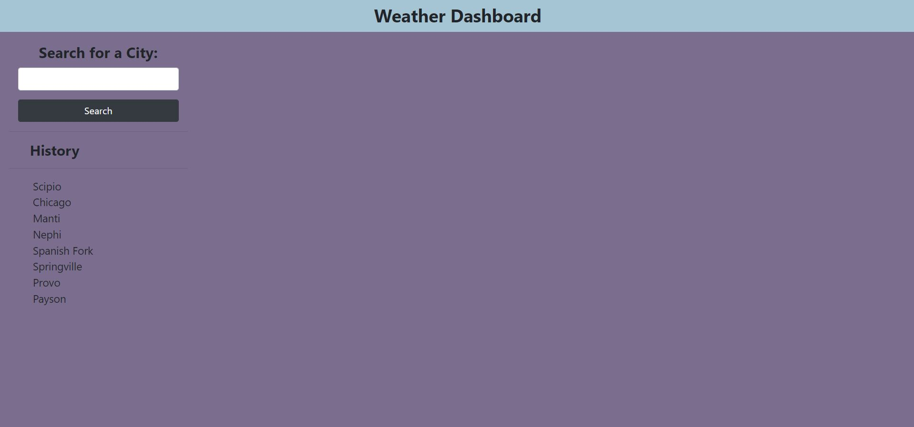
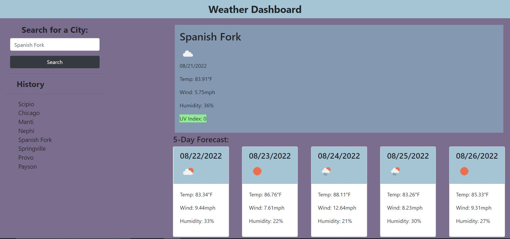

# Weather-Dashboard

## Description

This repository is a weather dashboard app that allows users to view the weather outlook for whatever city they may be looking to travel to, so that they can plan accordingly.

## Link to Deployed Application

[Weather Dashboard](https://avenix17.github.io/Weather-Dashboard/)

## Screenshots

## Change Log

### 2022-08-22

* Updated README
* Created assets folder for js and css files
* Added images folder for README
* Build javascript for weather dashboard - api calls and local storage function
* Finished css for the UI
* Changed a bunch of classes to ids in html, fixed class names
* Flushed out UI more